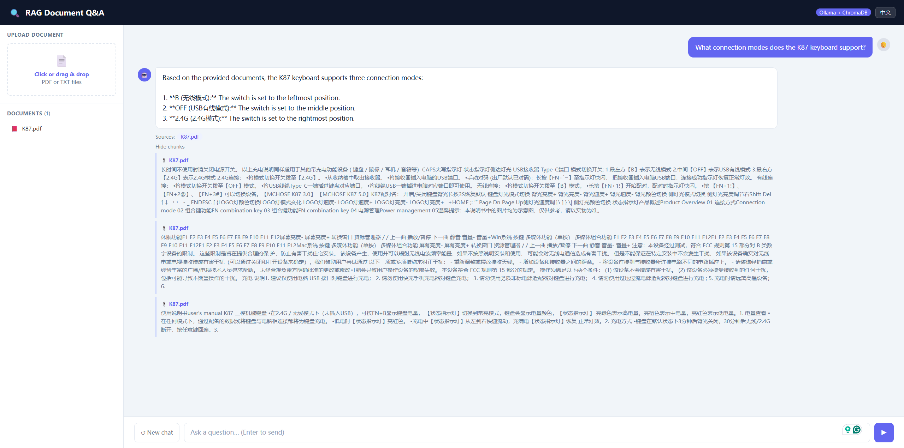
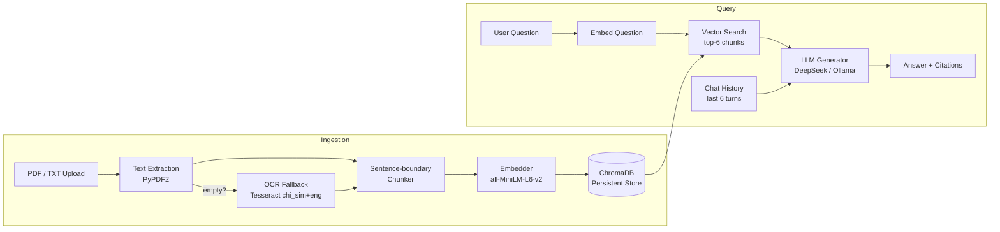

# RAG Document Q&A


A production-style **Retrieval-Augmented Generation (RAG)** pipeline that lets you upload PDF or TXT documents and ask questions in natural language — answers are grounded in your own documents, with source citations.

**Live Demo:** http://139.196.52.8 &nbsp;|&nbsp; Supports English and Chinese (中英文双语)



---

## Architecture



**Request flow:**
1. User uploads a document → text is extracted, split into sentence-aware chunks, embedded, and stored in ChromaDB
2. User asks a question → question is embedded, top-6 semantically similar chunks are retrieved, passed to LLM with conversation history
3. LLM responds with an answer grounded in the retrieved context; UI shows source citations and inspectable chunks

---

## Features

| Feature | Detail |
|---|---|
| **PDF & TXT upload** | Drag-and-drop or click to upload |
| **OCR fallback** | Scanned PDFs auto-detected (empty text → Tesseract, 2-thread parallel) |
| **Semantic retrieval** | `all-MiniLM-L6-v2` embeddings + ChromaDB, top-6 chunks |
| **Multi-turn conversation** | Last 6 turns of chat history passed to LLM for context |
| **Source citations** | Every answer shows which document it came from |
| **Chunk inspection** | Expand to see the exact passages that informed the answer |
| **Streaming output** | Tokens stream to the UI in real time (Server-Sent Events) |
| **Pluggable LLM** | DeepSeek (cloud) or Ollama (local, fully private) via env var |
| **Persistent index** | ChromaDB persists to disk; documents survive server restarts |
| **Bilingual UI** | Toggle between English and Chinese |

---

## Tech Stack

| Layer | Technology |
|---|---|
| Web Framework | FastAPI (async) |
| Embedding Model | `all-MiniLM-L6-v2` (sentence-transformers) |
| Vector Store | ChromaDB (persistent, local) |
| LLM | DeepSeek API (cloud) or Ollama (local) |
| PDF Parsing | PyPDF2 + pdf2image + Tesseract (OCR fallback) |
| Frontend | Vanilla JS, no build step |
| Deployment | Alibaba Cloud ECS, systemd + nginx reverse proxy |

---

## Design Decisions

**Why sentence-boundary chunking instead of fixed character splits?**
Splitting mid-sentence breaks semantic units and confuses the retrieval model. The chunker scans backward from the split point for sentence-ending punctuation (`. ! ? ;`) so each chunk is a complete thought.

**Why ChromaDB instead of Pinecone?**
ChromaDB runs locally with zero setup and persists to disk — no API key, no cost, no network call on every query. For a single-server demo this is faster and simpler. Pinecone would be the right call when scaling to multiple servers or needing managed infrastructure.

**Why DeepSeek over OpenAI?**
DeepSeek's API is OpenAI-compatible (drop-in replacement), costs ~20x less per token, and performance is comparable for document Q&A tasks. The codebase supports any OpenAI-compatible endpoint via env vars.

**Why no LangChain?**
Writing the RAG pipeline from scratch (chunker → embedder → vector store → generator) keeps the architecture transparent and avoids abstraction overhead. Each component is a small, testable module.

---

## Project Structure

```
rag-demo/
├── app.py              # FastAPI server — upload, ask, document management
├── rag/
│   ├── chunker.py      # Sentence-boundary-aware text chunking
│   ├── embedder.py     # Embedding model singleton (lazy-loaded, warm on startup)
│   ├── store.py        # ChromaDB persistent vector store
│   └── generator.py    # LLM wrapper (DeepSeek / Ollama, switchable via env)
├── static/
│   └── index.html      # Single-page UI (bilingual EN/ZH)
└── requirements.txt
```

---

## Quick Start

**Option A — Docker (recommended)**

```bash
git clone https://github.com/ZhenWei-Shi/rag-demo.git
cd rag-demo
cp .env.example .env          # fill in your API key
docker compose up --build
```

Open `http://localhost:8000`. ChromaDB data is persisted in a Docker volume.

---

**Option B — Cloud LLM (DeepSeek)**

```bash
git clone https://github.com/ZhenWei-Shi/rag-demo.git
cd rag-demo
pip install -r requirements.txt

# Set environment variables
export LLM_PROVIDER=openai_compat
export LLM_API_KEY=your_deepseek_key
export LLM_BASE_URL=https://api.deepseek.com
export LLM_MODEL=deepseek-chat

python app.py
```

**Option C — Local LLM (Ollama, fully private)**

```bash
# Install Ollama: https://ollama.com
ollama pull llama3.2

git clone https://github.com/ZhenWei-Shi/rag-demo.git
cd rag-demo
pip install -r requirements.txt
python app.py
```

Open `http://localhost:8000` in your browser.

---

## API Endpoints

| Method | Path | Description |
|---|---|---|
| `POST` | `/upload` | Upload and index a PDF or TXT file |
| `POST` | `/ask` | Ask a question; returns answer, sources, and retrieved chunks |
| `GET` | `/documents` | List all indexed documents |
| `DELETE` | `/documents/{filename}` | Remove a document from the index |
